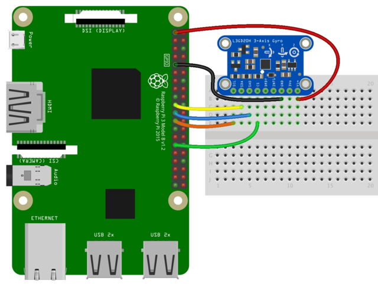
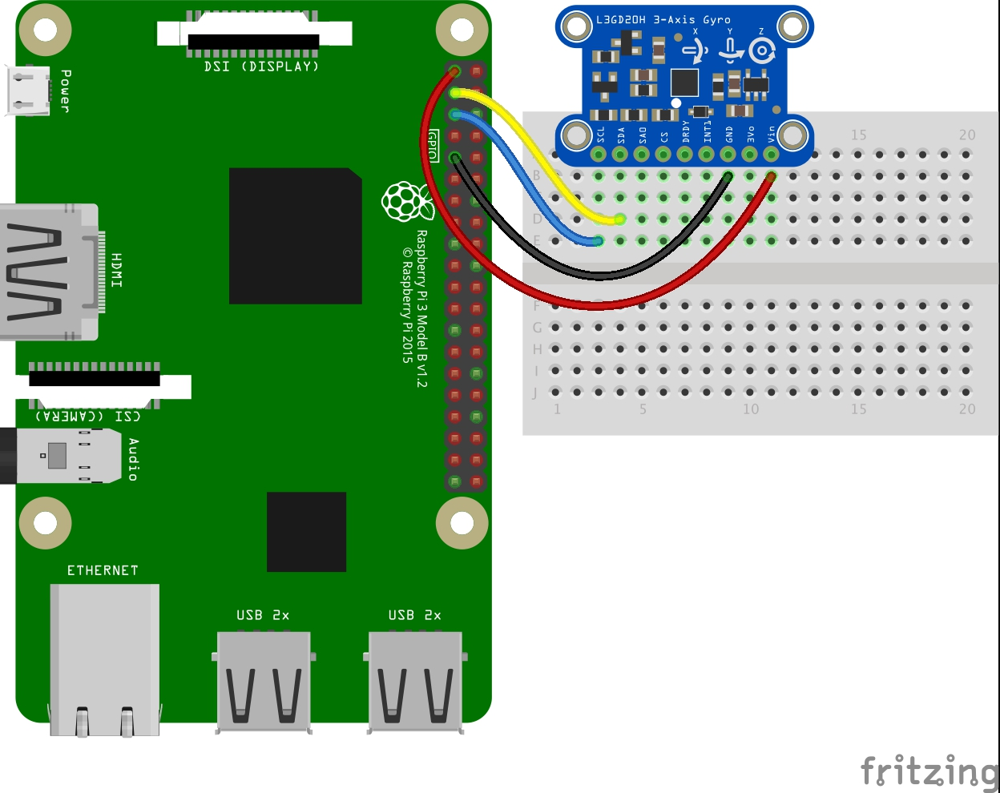

# Rasberry PI 3 Model B+


# BMP 388

* [product page](https://learn.adafruit.com/adafruit-bmp388/overview)

## Pinout


```
Pi 3V3 to sensor VIN
Pi GND to sensor GND
Pi SCL to sensor SCK
Pi SDA to sensor SDI
```

## Code

* https://github.com/getelectronics/PIBits/blob/master/python/bmp388.py
* http://www.pibits.net/code/raspberry-pi-and-bmp388-barometric-pressure-sensor-example.php

# Camera

* SainSmart
* not very good, out of focus, cannot fix in software

## ArduCam AutoFocused Camera

* https://github.com/ArduCAM/RaspberryPi

# Gyro

* Adafruit L3GD20H
* Use SPI, since I2C already taken

```
Pi 3V3 to sensor Vin
Pi GND to sensor GND
Pi MOSI to sensor SDA
Pi MISO to sensor SA0
Pi SCLK to sensor SCL
Pi #5 to sensor CS (or use any other free GPIO pin)
```
* [code](https://forum.pololu.com/t/gyro-l3gd20h-driver-raspberry-pi/8080)

* SPI doesn't work, go with I2C



* still not work