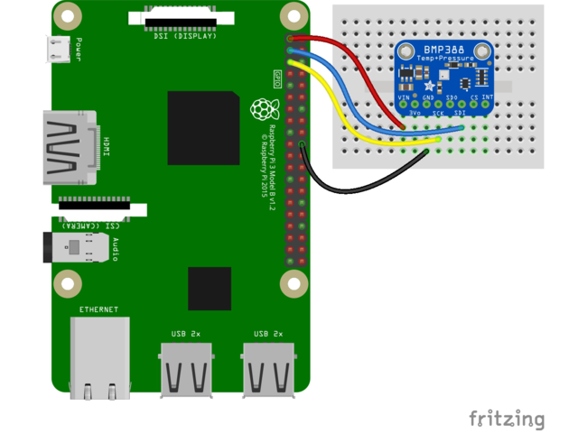

# BMP 388

* [product page](https://learn.adafruit.com/adafruit-bmp388/overview)

## Pinout


```
Pi 3V3 to sensor VIN
Pi GND to sensor GND
Pi SCL to sensor SCK
Pi SDA to sensor SDI
```

## Code

* https://github.com/getelectronics/PIBits/blob/master/python/bmp388.py
* http://www.pibits.net/code/raspberry-pi-and-bmp388-barometric-pressure-sensor-example.php

