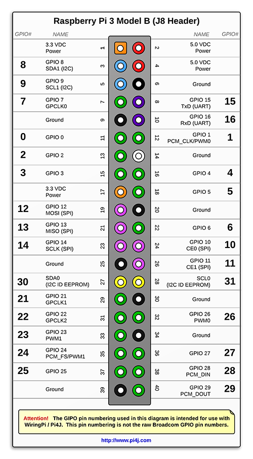
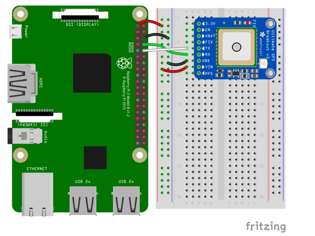
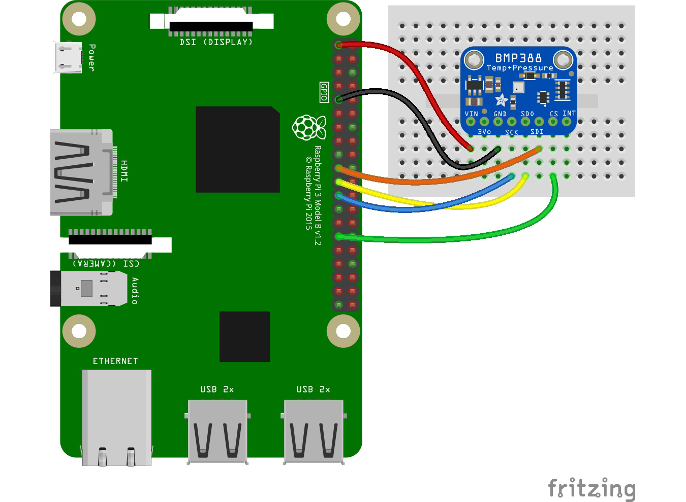
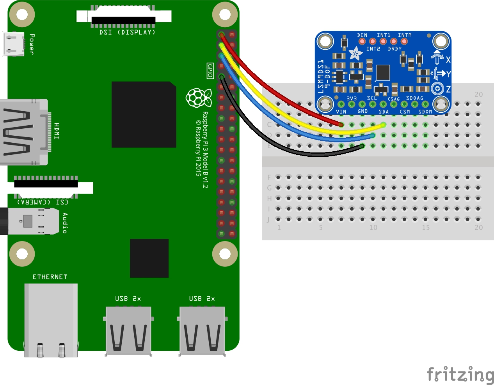
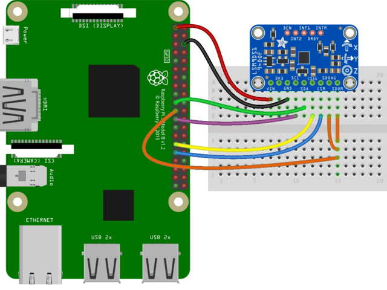

# Rasberry PI 3 Model B+



# GPS

* Adafruit Ultimate GPS
* https://learn.adafruit.com/adafruit-ultimate-gps/overview

```
GPS Vin  to 3.3V (red wire)
GPS Ground to Ground (black wire)
GPS RX to TX (green wire)
GPS TX to RX (white wire)
```

* start gpsd
`sudo gpsd /dev/serial0 -F /var/run/gpsd.sock`
* monitoring
`cgps -s`

# BMP 388

* https://learn.adafruit.com/adafruit-bmp388/overview

## Pinout


```
Pi 3V3 to sensor VIN
Pi GND to sensor GND
Pi SCL to sensor SCK
Pi SDA to sensor SDI
```

* SPI (used)



```
Pi 3V3 to sensor VIN
Pi GND to sensor GND
Pi MOSI to sensor SDI
Pi MISO to sensor SDO
Pi SCLK to sensor SCK
Pi #5 to sensor CS (or use any other free GPIO pin)
```

## Code

* https://github.com/getelectronics/PIBits/blob/master/python/bmp388.py
* http://www.pibits.net/code/raspberry-pi-and-bmp388-barometric-pressure-sensor-example.php

# Camera

* SainSmart
* not very good, out of focus, cannot fix in software

## ArduCam AutoFocused Camera

* https://github.com/ArduCAM/RaspberryPi

# Gyro

## Adafruit LSM9DS1

* https://learn.adafruit.com/adafruit-lsm9ds1-accelerometer-plus-gyro-plus-magnetometer-9-dof-breakout/python-circuitpython

* I2C (used)


```
Pi 3V3 to sensor VIN
Pi GND to sensor GND
Pi SCL to sensor SCL
Pi SDA to sensor SDA
```
* SPI
    * tried, but too complicated to work 


```
Pi 3V3 to sensor VIN
Pi GND to sensor GND
Pi SCLK to sensor SCL
Pi MOSI to sensor SDA
Pi MISO to sensor SDOAG AND sensor SDOM
Pi GPIO5 to sensor CSAG
Pi GPIO6 to sensor CSM
```